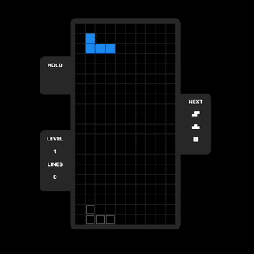
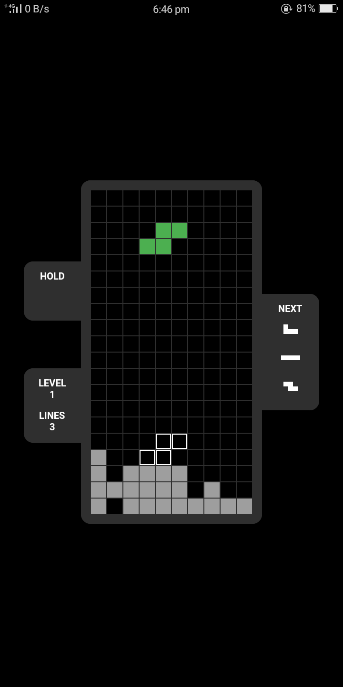
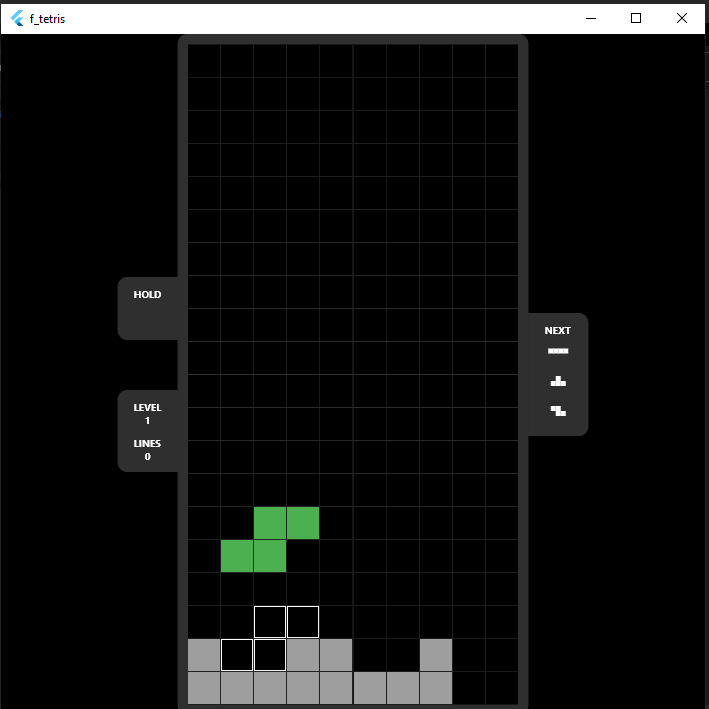
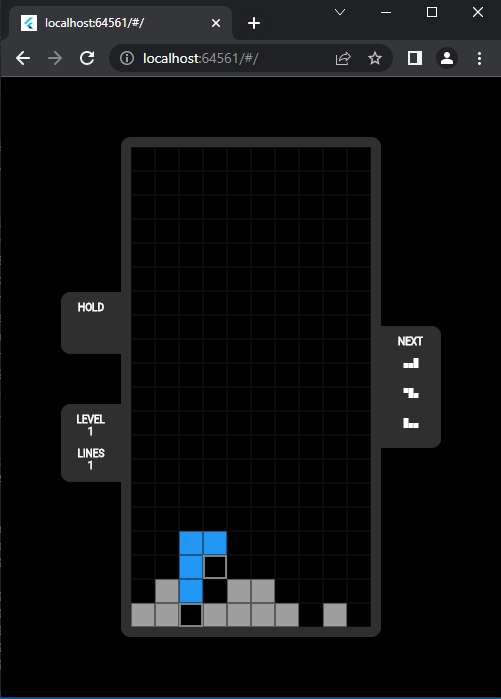

# Fluttetris

This is a simple Tetris game built with Flutter, a popular UI toolkit for building natively compiled applications for mobile, web, and desktop platforms.

## Controls

Control Tetrominos with keyboard or gestures.

| Action                  | Key   | Gesture                 |
|-------------------------|-------|-------------------------|
| move right              |   →   | swipe right             |
| move left               |   ←   | swipe left              |
| rotate right            |   D   | tap right               |
| rotate left             |   A   | tap left                |
| hold                    |   ↑   | swipe up                |
| soft drop               |   ↓   | hold and swipe down     |
| hard drop               | SPACE | swipe down              |
| Restart                 |  ESC  |                         |

## Screenshots

Android Screen            | Desktop Screen        | Web Screen      | 
:-------------------------:|:-------------------------:|:----------------------:|
   |  |    | 

## Features

- The game follows the classic Tetris mechanics of fitting Tetriminos into a grid to complete lines and score points.
- The game can be run on multiple platforms including Android, iOS, and web.
- The Tetrominos can be rotated using different gestures and/or keys.
